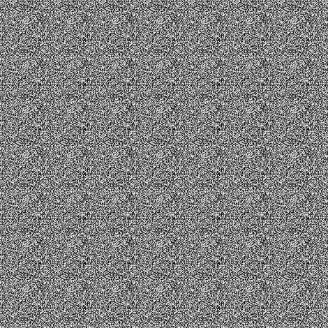
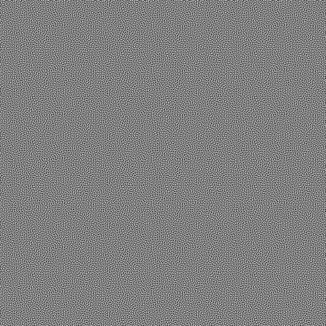
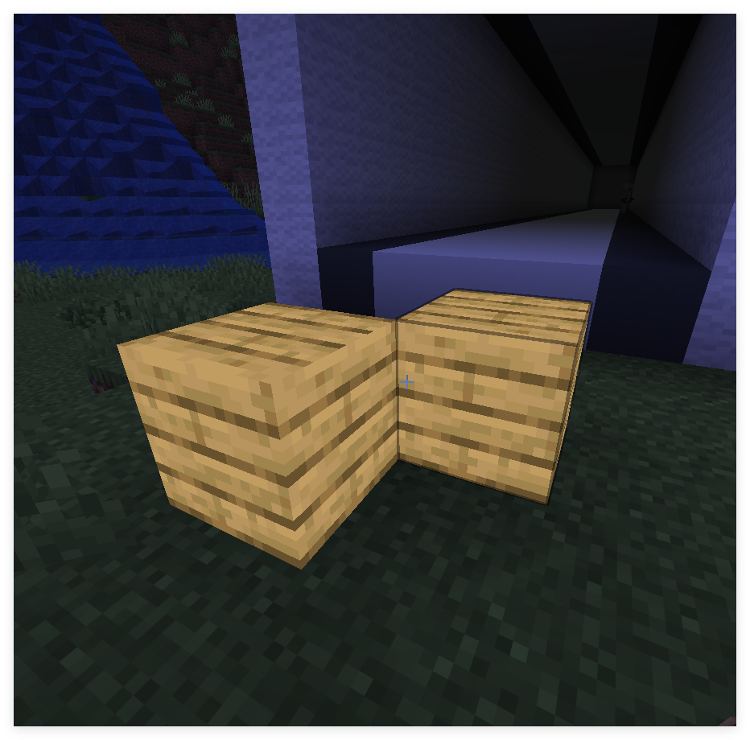
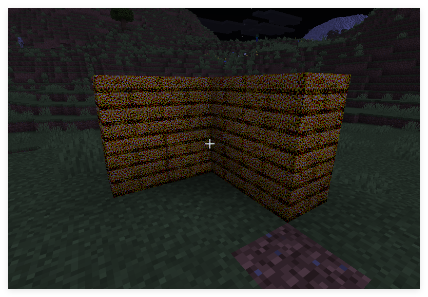
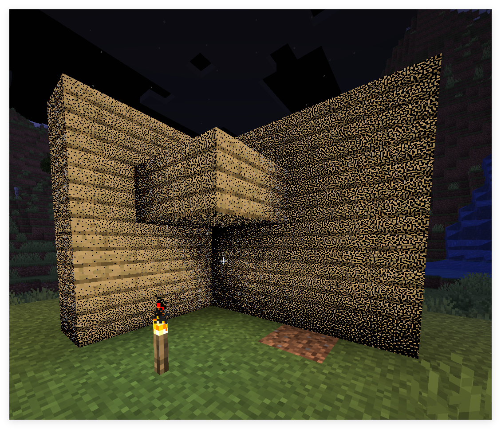

<FeatureHead
    title='着色器实践篇 - 灰度和抖动'
    authorName='轩宇1725'
/>

# 着色器实践篇 - 灰度和抖动

## 摘要

本文介绍了灰度概念与一种常见的二值化方法——抖动。介绍了常见的噪声类型，程序化生成以及预计算纹理的使用以及修复 NEAREST 采样失效的方法。

## 前言

灰度（Gray Scale）是在 8-bit (0-255) 精度下描述颜色深浅的属性。或称为 256 阶灰度。而抖动（Dithering）是一种很常见二值化技术，基本思想是只使用两个颜色实现过渡的效果。

早期的打印机和显示器由于硬件限制，只能显示二值的颜色，达不到 256 阶灰度的要求，因此往往会使用特定的空间（或时间）上的噪声来欺骗人眼感知到类似的灰度效果。这就是抖动。

现在很多场景也会使用抖动来作为风格化渲染，模拟复古画面。

抖动不一定是二值的，也有更高阶的抖动，但二值抖动是最典型和通用的模式。


在这一期教程中，我们鼓励读者使用 [shadertoy](https://www.shadertoy.com/new) 进行算法的实现和修改，再放进 minecraft 着色器。shadertoy 上也有很多用户分享的抖动噪声生成算法。

## 抖动的类型

我们讨论抖动的类型，实际上就是在讨论噪声的类型。

1. 白噪声（White Noise）

```glsl
float whiteNoise(vec2 p){
    return fract(sin(dot(p, vec2(12.9898,78.233))) * 43758.5453);
}
```



这是最朴素的一种噪声，特征是各频率能量均匀，空间/时间上完全随机，无任何结构性。由于白光由所有频率的可见光均匀混合而成，故得名“白噪声”。

但人眼对低频噪声敏感，白噪声虽然实现简单，但显得图像更“脏”。白噪声抖动容易产生锐利的闪烁和斑点。

2. 蓝噪声（Blue Noise）

蓝噪声的能量随着频率升高而升高——低频能量低，高频能量高。视觉上更加纯净和自然。同样由光学特性得名，即蓝光频率更高。

蓝噪声相比于白噪声比较难以生成，一般下载预生成的图片使用。



3. “颜色噪声”

通过前两个例子，我们可以预测还有一些其他的颜色噪声，实际上确实有。

我们定义谱功率密度函数（Spectral Power Density Function, SPD 或 PSD）为 $S(f)$，其中 $f$ 为频率。可以分别定义出各种不同的噪声类型：

| 噪声类型       | SPD                 |
| -------------- | ------------------- |
| 棕噪声(红噪声) | $S(f) \propto 1/f^2$ |
| 粉噪声         | $S(f) \propto 1/f$   |
| 白噪声         | $C$                 |
| 蓝噪声         | $S(f) \propto f$     |
| 紫噪声         | $S(f) \propto f^2$   |

4. 有序抖动

实际上Minecraft已经内置了一个抖动，我们可以称之为 “Notch抖动”，这张纹理存放在 `textures/effect/dither.png`


这张纹理上有16个不同的灰度等级（均分原本的256阶灰度），被用于一个叫 notch 的后处理管线

```json
// 1.17 中的 post/notch.json
{
    "targets": [
        "swap"
    ],
    "passes": [
        {
            "name": "notch",
            "intarget": "minecraft:main",
            "outtarget": "swap",
            "auxtargets": [
                {
                    "name": "DitherSampler",
                    "id": "dither",
                    "width": 4,
                    "height": 4,
                    "bilinear": false
                }
            ]
        },
        {
            "name": "blit",
            "intarget": "swap",
            "outtarget": "minecraft:main"
        }
    ]
}
```

```glsl
// notch.fsh
#version 150

uniform sampler2D DiffuseSampler;
uniform sampler2D DitherSampler;

in vec2 texCoord;

uniform vec2 InSize;

out vec4 fragColor;

void main() {
    vec2 halfSize = InSize * 0.5;

    vec2 steppedCoord = texCoord;
    steppedCoord.x = float(int(steppedCoord.x*halfSize.x)) / halfSize.x;
    steppedCoord.y = float(int(steppedCoord.y*halfSize.y)) / halfSize.y;

    vec4 noise = texture(DitherSampler, steppedCoord * halfSize / 4.0);
    vec4 col = texture(DiffuseSampler, steppedCoord) + noise * vec4(1.0/12.0, 1.0/12.0, 1.0/6.0, 1.0);
    float r = float(int(col.r*8.0))/8.0;
    float g = float(int(col.g*8.0))/8.0;
    float b = float(int(col.b*4.0))/4.0;
    fragColor = vec4(r, g, b, 1.0);
}
```

事实上这张图像是一个 4x4 的 Bayer 矩阵，Bayer 矩阵是最常见的有序抖动矩阵。

不同阶的 Bayer 矩阵可以使用递归生成:

$$
B_2 = \begin{pmatrix} 0 & 2 \\ 3 & 1 \end{pmatrix}, \quad
B_{2n} = \begin{pmatrix} 4B_n & 4B_n + 2 \\ 4B_n + 3 & 4B_n + 1 \end{pmatrix}
$$

容易验证 Notch 抖动就是 4 阶的 Bayer 矩阵。

5. 误差扩散

误差扩散是一种串行的抖动方法，不太适合实时渲染着色器实现，这里只是提出这个概念，感兴趣的读者可以自行搜索 Floyd–Steinberg dithering。

## 抖动的实现

1. 加法抖动

无论我们使用什么样的噪声，要做的操作都是对像素进行噪声叠加，然后量化（在这里我们量化为纯黑和纯白两种颜色），从而实现抖动的效果。

下面是 shadertoy 上的一个简单的抖动实现示例：

```glsl
void mainImage( out vec4 fragColor, in vec2 fragCoord )
{
    // Normalized pixel coordinates (from 0 to 1)
    vec2 uv = fragCoord/iResolution.xy;

    // sample color and noise
    vec3 col = texture(iChannel0, uv).rgb;
    float gray = dot(col, vec3(0.299, 0.587, 0.114));
    float noise = texture(iChannel1, uv).r - 0.5;
    
    // mix noise with color
    float dithered = gray + 0.5 * noise;
    
    // quantize
    float quantized = step(0.5, dithered);

    // Output to screen
    fragColor = vec4(vec3(quantized),1.0);
}
```


也可将 RGB 三个通道分开抖动


叠加噪声的幅度通常为 $0.5 * (1 / 2^n)$，其中 n 为量化的位数。这里我们量化为 1 位，因此幅度为 0.5。

这里用到了 `step` 函数，它的作用是将输入值与阈值进行比较，若大于阈值则输出 1，否则输出 0。

我们也可以用它实现一个多阶量化函数

```glsl
float quantize(float value, float levels) {
    return floor(value * (levels - 1.0)) / (levels - 1.0);
}
```

下图是使用蓝噪声4阶彩色量化的效果：


2. 噪声阈值抖动

上面的噪声也可以直接当做阈值来使用，实际效果与加法抖动类似。读者可以自行实现，对于阈值抖动，我们详细介绍下面基于 Bayer 矩阵的阈值抖动。

3. Bayer 矩阵抖动

Bayer 矩阵抖动不是使用加法，而是将 Bayer 矩阵的值作为阈值，直接比较像素值是否大于阈值，从而决定输出黑色还是白色。

```glsl
const mat4 BAYER = mat4(
    vec4( 0.0/16.0,  8.0/16.0,  2.0/16.0, 10.0/16.0),
    vec4(12.0/16.0,  4.0/16.0, 14.0/16.0,  6.0/16.0),
    vec4( 3.0/16.0, 11.0/16.0,  1.0/16.0,  9.0/16.0),
    vec4(15.0/16.0,  7.0/16.0, 13.0/16.0,  5.0/16.0)
);

float bayerThreshold(ivec2 p) {
    int x = p.x & 3;   // mod 4
    int y = p.y & 3;
    return BAYER[x][y];
}

void mainImage(out vec4 fragColor, in vec2 fragCoord) {
    vec2 uv = fragCoord / iResolution.xy;
    vec3 col = texture(iChannel0, uv).rgb;

    float gray = dot(col, vec3(0.299, 0.587, 0.114));
    float t = bayerThreshold(ivec2(fragCoord));
    float dithered = step(t, gray);

    fragColor = vec4(vec3(dithered), 1.0);
}
```


这里通过模运算，相当于将 Bayer 矩阵重复铺满整个屏幕，然后将每个像素的灰度值与对应的阈值进行比较，从而实现抖动效果。

也可对 RGB 三个通道分别进行抖动。


## 应用

上面的抖动方法可以应用在很多场景中，比如用于优化之前 “着色器实践篇 - 简单2D场景的搭建” 中的透射效果。

```glsl
bool random_chance(float alpha_factor) {
    float rand_value = fract(sin(dot(gl_FragCoord.xy ,vec2(12.9898,78.233))) * 43758.5453);
    return rand_value < alpha_factor;
}
```


这里实现的实际上就是前文提到的白噪声阈值抖动，由于低频噪声的存在，透射效果比较脏，我们可以换成 Bayer 矩阵抖动或者蓝噪声抖动来改善效果。（不过核心着色器内并不能访问到 Notch 抖动的纹理，所以得自己写一个 Bayer 矩阵）

```glsl
const mat4 BAYER = mat4(
    vec4( 0.0/16.0,  8.0/16.0,  2.0/16.0, 10.0/16.0),
    vec4(12.0/16.0,  4.0/16.0, 14.0/16.0,  6.0/16.0),
    vec4( 3.0/16.0, 11.0/16.0,  1.0/16.0,  9.0/16.0),
    vec4(15.0/16.0,  7.0/16.0, 13.0/16.0,  5.0/16.0)
);

float bayerThreshold(ivec2 p) {
    int x = p.x & 3;   // mod 4
    int y = p.y & 3;
    return BAYER[x][y];
}

void main() {
    vec4 color = texture(Sampler0, texCoord0) * vertexColor * ColorModulator;
    float max_component = max(gl_FragCoord.x, gl_FragCoord.y);
    float dist = distance(gl_FragCoord.xy/max_component, ScreenSize / (2.0 * max_component));
    float target_z = -0.97; // 目标物体的 z_view 值, 此项由数据包层面传递给着色器，后文介绍
    float distance_min = 0.03; // 距离阈值，低于该距离完全透射
    float distance_max = 0.50; // 距离衰减范围，高于该距离完全不透射
    if (depth < target_z) {
        float t = bayerThreshold(ivec2(gl_FragCoord.xy));
        float normalized_dist = (dist - distance_min) / (distance_max - distance_min);
        float dithered = step(t, normalized_dist);
        if(dithered == 0.0){
            discard;
        }
    }

#ifdef ALPHA_CUTOUT
    if (color.a < ALPHA_CUTOUT) {
        discard;
    }
#endif
    fragColor = apply_fog(color, sphericalVertexDistance, cylindricalVertexDistance, FogEnvironmentalStart, FogEnvironmentalEnd, FogRenderDistanceStart, FogRenderDistanceEnd, FogColor);
}

```


效果显著更好了，这是由于 Bayer 抖动是有序抖动，虽然有低频成分，但人眼对周期的容忍度高于白噪声的随机团簇结构，所以视觉上更干净。

这里的核心结构在于

```glsl
float t = bayerThreshold(ivec2(gl_FragCoord.xy));
float normalized_dist = (dist - distance_min) / (distance_max - distance_min);
float dithered = step(t, normalized_dist);
```

与前文的抖动实现类似。

> 事实上处理透射的问题天然回到了抖动问题的本质上。solid类型的物体（虽然现在合并到了terrain着色器重新）不输出半透明像素。所以这里只有保留像素和丢弃的两种情况，用抖动近似半透明是一个很自然的选择。事实上，这里的 `normalized_dist` 就是 solid 的 alpha 值。

## 预计算的噪声

在一些场景里我们还是会选择颜色噪声，但是在每个片元着色器内计算蓝噪声或者其他颜色噪声的代价比较高，所以我们可以选择预计算的方式，将噪声嵌入到纹理中。


这里我们打包了一张 $16*16$ 的纹理和一张 $64*64$ 的噪声在一张 $128*128$ 的图像中。采样时，归一化的纹理坐标分别对应：

`[0, 0]` 到 `[1/8, 1/8]` 为 $16*16$ 的纹理

`[1/8, 1/8]` 到 `[5/8, 5/8]` 为 $64*64$ 的噪声

在 “着色器基础篇 - 精准采样纹理” 中我们介绍了如何在着色器中精准采样纹理，这里我们可以使用同样的方法来采样噪声。

```glsl
vec2 imgSize = vec2(128.0, 128.0);
vec2 atlasSize = textureSize(Sampler0, 0);

vec2 scale = imgSize / atlasSize;
vec2 sampleCoord = texCoord0 + (imgCoord - normalizedUV) * scale;
```

这里我们可以在顶点数据上额外定义一个 `vec2 noiseCoord`，它的范围是 `[1/8, 1/8]` 到 `[5/8, 5/8]`，然后在片元着色器中使用 `noiseCoord` 来采样噪声.

```glsl
if(gl_VertexID % 4 == 0){
    normalizedUV = vec2(0.0, 0.0);
    colorCoord = vec2(0.0, 0.0);
    noiseCoord = vec2(1.0/8.0, 1.0/8.0);
}else if(gl_VertexID % 4 == 1){
    normalizedUV = vec2(0.0, 1.0);
    colorCoord = vec2(0.0, 1.0/8.0);
    noiseCoord = vec2(1.0/8.0, 5.0/8.0);
}else if(gl_VertexID % 4 == 2){
    normalizedUV = vec2(1.0, 1.0);
    colorCoord = vec2(1.0/8.0, 1.0/8.0);
    noiseCoord = vec2(5.0/8.0, 5.0/8.0);
}else if(gl_VertexID % 4 == 3){
    normalizedUV = vec2(1.0, 0.0);
    colorCoord = vec2(1.0/8.0, 0.0);
    noiseCoord = vec2(5.0/8.0, 1.0/8.0);
}
```

我们封装一下函数

```glsl
vec4 textureImg(sampler2D sampler, vec2 imgCoord, float definition) { // 注意这里的 definition 是整张纹理的分辨率.
    vec2 atlasSize = textureSize(sampler, 0);
    vec2 scale = vec2(definition) / atlasSize;
    vec2 sampleCoord = texCoord0 + (imgCoord - normalizedUV) * scale;
    ivec2 correctedCoord = ivec2(floor(sampleCoord * atlasSize)); // 缩放坐标后可能有精度问题，使用整数坐标直接采样纹素以强制 NEAREST.
    return texelFetch(sampler, correctedCoord, 0);
}
```

这样一来就可以直接采样颜色和噪声了

```glsl
vec4 color = textureImg(Sampler0, colorCoord, 128.0);
vec4 noise = textureImg(Sampler0, noiseCoord, 128.0);
```

如果在模型中只贴左上角纹理，那么采样噪声时就要用大于 1 的纹理坐标，即颜色部分的坐标是 `[0, 0]` 到 `[1, 1]`, 噪声部分则是 `[1, 1]` 到 `[5, 5]`，如果两块纹理的大小不能整除，可能会出现走样的问题。所以我们在这里选择把整张图都贴上去（实际上替换文件即可）。

另外，我们在四个角加上 `alpha` 通道为 254 的像素，作为特殊面的判据。在核心着色器中通过 `flat` 关键字传出 `bool isTargetFace`

```glsl
flat out int isTargetFace;

void main() {
    ...
    float rawAlpha = textureLod(Sampler0, UV0, 0).a;
    isTargetFace = (abs(rawAlpha - 254.0/255.0) < 0.001) ? 1 : 0;
}
```

> 这里不需要使用半纹素纠正，因为 Minecraft 的纹理过滤都是 NEAREST 类型。

`flat` 关键字在这里的用途是只使用第一个顶点的值，从而让不可插值的 `int` 类型允许传递并在片元着色器中保持一致。

验证颜色和噪声都可以被单独采样

```glsl
if(isTargetFace == 1) {
    vec4 color = textureImg(Sampler0, colorCoord, 128.0);
    vec4 noise = textureImg(Sampler0, noiseCoord, 128.0);
    fragColor = color;
    return;
}
```



```glsl
if(isTargetFace == 1) {
    vec4 color = textureImg(Sampler0, colorCoord, 128.0);
    vec4 noise = textureImg(Sampler0, noiseCoord, 128.0);
    fragColor = noise;
    return;
}
```


下面加入完整的光影计算和抖动

```glsl
if(isTargetFace == 1) {
    vec4 color = textureImg(Sampler0, colorCoord, 128.0);
#ifdef ALPHA_CUTOUT
    if (color.a < ALPHA_CUTOUT) {
        discard;
    }
#endif
    vec4 noise = textureImg(Sampler0, noiseCoord, 128.0) - vec4(0.5, 0.5, 0.5, 0.0);        
    vec3 dithered = color.rgb + 0.5 * noise.rgb;
    vec4 quantized = vec4(step(0.5, dithered), color.a) * vertexColor;

    quantized = mix(FogColor * vec4(1, 1, 1, color.a), quantized, ChunkVisibility);
    fragColor = apply_fog(quantized, sphericalVertexDistance, cylindricalVertexDistance, FogEnvironmentalStart, FogEnvironmentalEnd, FogRenderDistanceStart, FogRenderDistanceEnd, FogColor);
    return;
}
```



或者对亮度做抖动

```glsl
if(isTargetFace == 1) {
    vec4 color = textureImg(Sampler0, colorCoord, 128.0);
#ifdef ALPHA_CUTOUT
    if (color.a < ALPHA_CUTOUT) {
        discard;
    }
#endif
    float noise = textureImg(Sampler0, noiseCoord, 128.0).r - 0.5;
    float gray_scale = dot(vertexColor.rgb, vec3(0.299, 0.587, 0.114));
    float dithered = gray_scale + 0.5 * noise;
    float quantized = step(0.5, dithered);

    color *= quantized;

    color = mix(FogColor * vec4(1, 1, 1, color.a), color, ChunkVisibility);
    fragColor = apply_fog(color, sphericalVertexDistance, cylindricalVertexDistance, FogEnvironmentalStart, FogEnvironmentalEnd, FogRenderDistanceStart, FogRenderDistanceEnd, FogColor);
    return;
}
```

