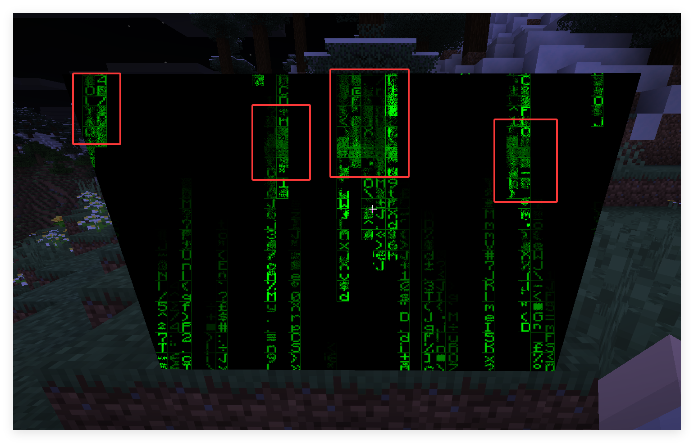
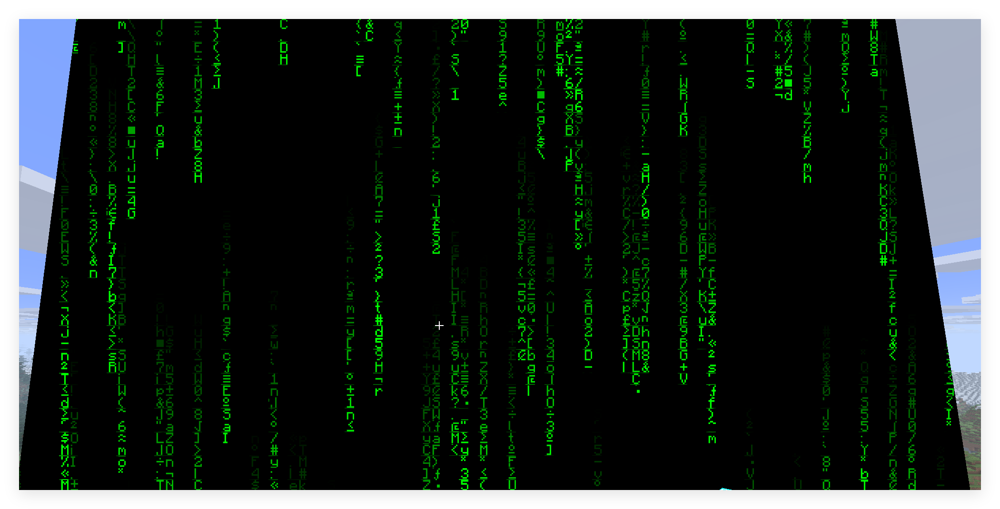
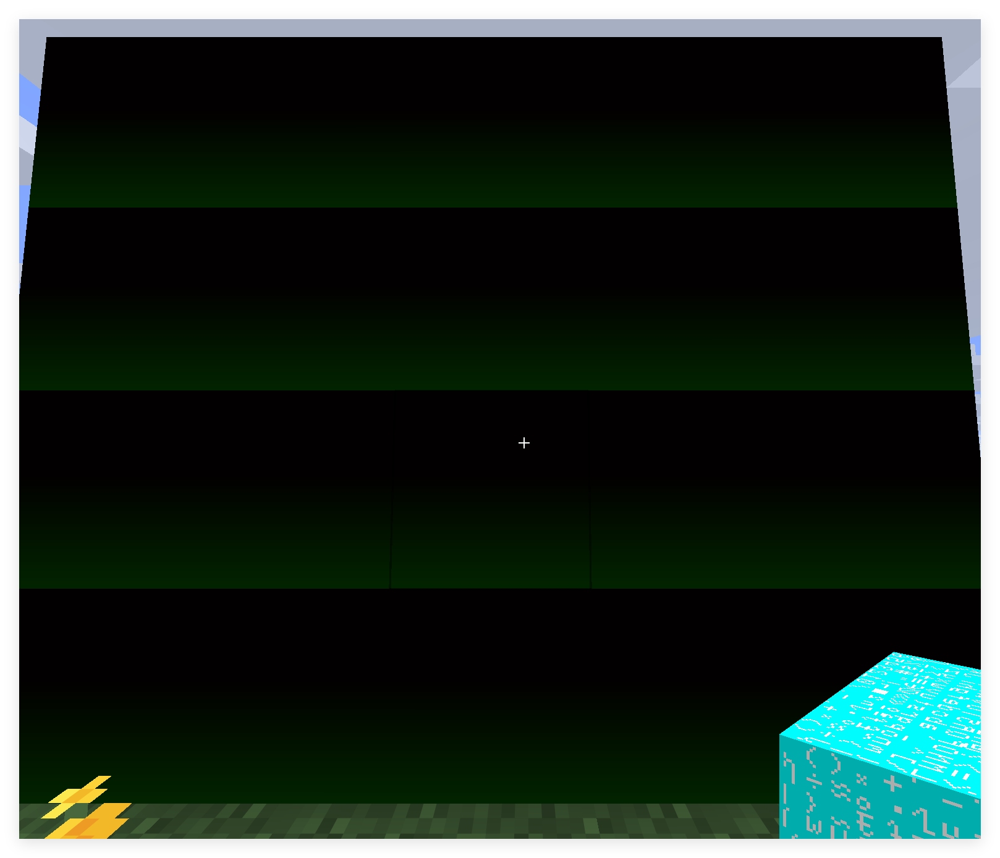

<FeatureHead
    title='着色器实践篇 - 精准采样纹理'
    authorName='轩宇1725'
/>

## 摘要

本文提供了一种稳定且精准地采样面上纹理的方法。解决了原有的数值稳定性问题，以便于着色器获取纹理上的额外信息。

## 前言

本文要讨论的话题不是如何采样然后显示颜色，这早就已经在核心着色器的工作流程中介绍过了，而更深入的采样理论将会在别的话题中介绍。本文考虑的问题是如何在片元着色器内精准地获取贴在这个面上的纹理信息。

在之前的 “着色器实践篇 - 代码雨方块” 和 “着色器进阶篇 - 基于物理的渲染（PBR）” 中，我们介绍了一种通过 $P = kX+B$ 的变换，把面内的归一化纹理坐标转化为精灵图坐标进行采样的办法。然而，这种办法使用的偏导数存在数值稳定性问题，采样时会产生噪声，导致结果失真。



因此，我们希望使用一种更稳定的采样方式，按照给定的归一化纹理坐标精准采样。

## 通过纹理分辨率计算

如果我们预先知道纹理的分辨率是多少，那就好办了。我们将材质的尺寸记为 `vec2 imgSize` 或者 `ivec2 imgSize`（我们使用 `vec2` 多一点，因为它更加适合插值和计算）。

我们的目标是在任何一个片元的上下文中用归一化坐标采样，还需要知道纹理图集的尺寸。纹理图集的尺寸的尺寸实际上就是 Sampler0 的尺寸，我们可以直接通过 `vec2 atlasSize = textureSize(Sampler0, 0)` 获取。（第二个参数是Lod）

那么归一化坐标 `imgCoord` 对应的 Sampler0 的实际采样坐标就是起点坐标加上 `imgCoord * imgSize / atlasSize`

下面我们计算起点的坐标。考察任一片元，我们能通过和之前类似的方法得到它在面内的归一化坐标 `vec2 normalizedUV` 和插值得到的 `texCoord0`, 和上文的逻辑一样，这里有关系 `texCoord0 = startCoord + normalizedUV * imgSize / atlasSize`

除了 `startCoord` 都是已知的，所以 `startCoord = texCoord0 - normalizedUV * imgSize / atlasSize`

所以我们得到从归一化坐标到 Sampler0 的实际采样坐标的映射

```glsl
vec2 imgSize = ... ;
vec2 atlasSize = textureSize(Sampler0, 0);

vec2 startCoord = texCoord0 - normalizedUV * imgSize / atlasSize;
vec2 sampleCoord = startCoord + imgCoord * imgSize / atlasSize;
```

化简后

```glsl
vec2 imgSize = ... ;
vec2 atlasSize = textureSize(Sampler0, 0);

vec2 scale = imgSize / atlasSize;
vec2 sampleCoord = texCoord0 + (imgCoord - normalizedUV) * scale;
```



可以看到噪声消失，采样十分干净。

## 注意事项

Minecraft 不同版本之间可能会更改顶点和采样坐标的排列（事实上 Mojang 确实更改过几次）。确保 `normalizedUV` 的环绕方向与 `texCoord0` 一致。

在之前的模型中，我们有关系 `texCoord0 = k * normalizedUV + b` ，这里的 `k = imgSize / atlasSize` `b = startCoord` , 如果环绕方向不一致，输出 `startCoord` 会看到某个方向上，b 线性变化。下图展示了当 `texCoord0` 以左上角为原点，而 `normalized` 以左下角为原点时 `fragColor = vec4(startCoord, 0.0, 1.0);` 的输出结果。



更多的实例将在后续的 “着色器实践篇 - 灰度与抖动” 中展示。