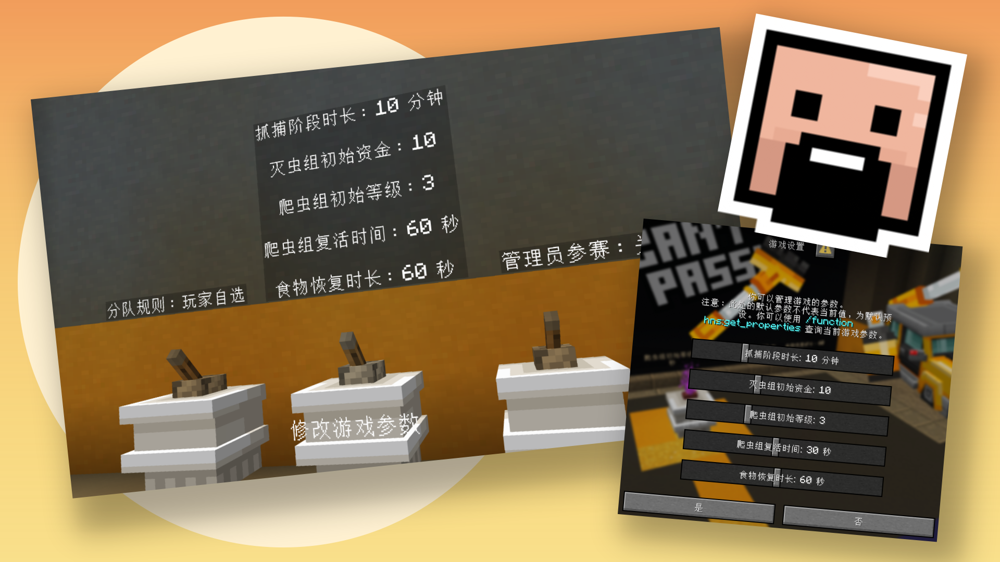
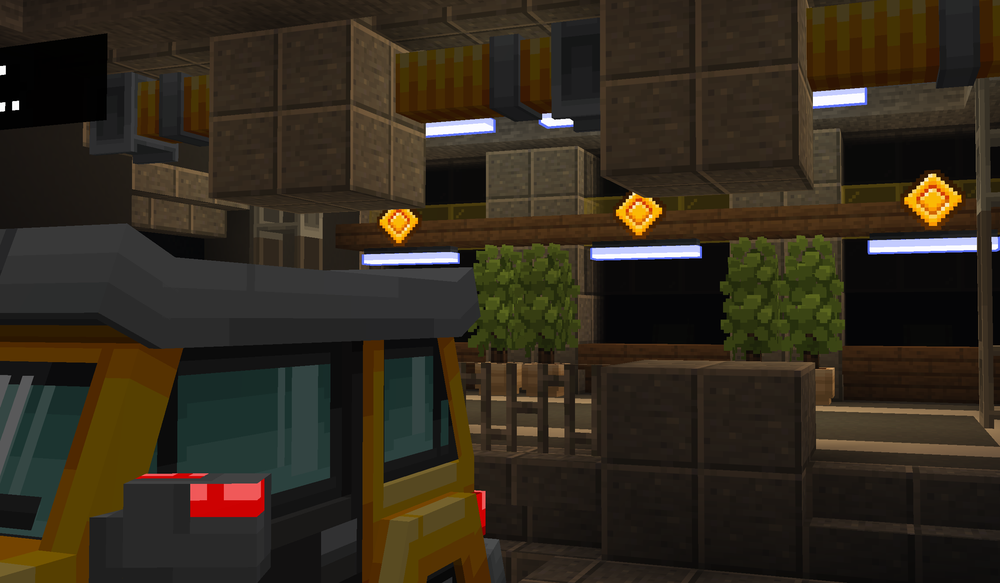
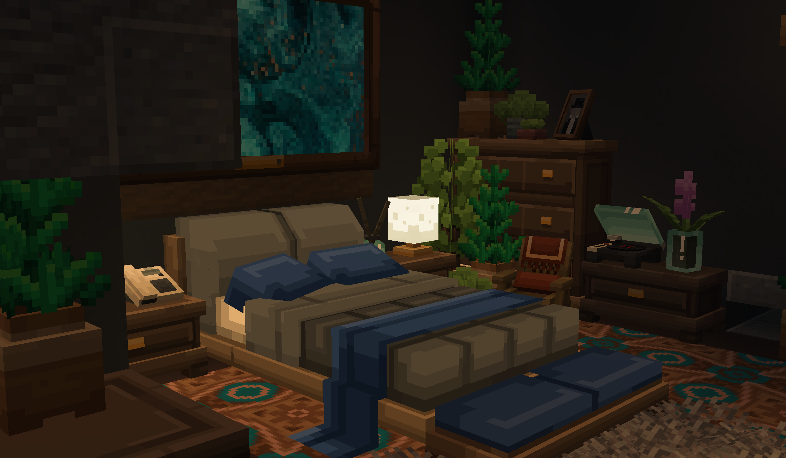
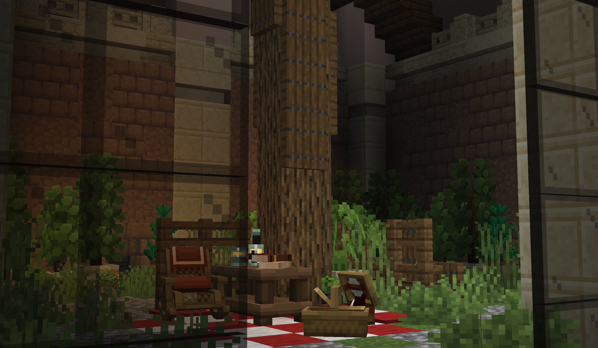
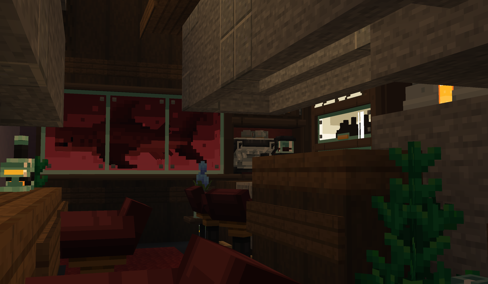

<FeatureHead
    title='蟑螂必须死！Pest Cant Pass！'
    authorName='CR_019'
    :extraAuthors="['镇川','轩宇1725']"
    cover = '../_assets/5.png'
    resourceLink = 'https://www.bilibili.com/video/BV175Ta6BE3k'
/>

> 当你发现家中出现一只蟑螂时，就说明在暗处已经藏着一千只蟑螂了……  
> 话说回来，谁又能拒绝变成一只广式双马尾呢！

## **【 NEW MAP | 全新地图 】**

最新1.21.11版本多人小游戏地图 **【蟑螂必须死Pest Can't Pass】** 现已发布

玩家可以选择扮演 **【灭虫队队员】** 或 **【蟑螂】** 在豪宅中展开追逐战，在限定时间到达前，只要还有 **【蟑螂】** 存活，**【灭虫队】** 就会失败

***

## **【 INTRODUCTION | 游戏详情 】**

### **【灭虫队】**.png)

> 专业的有害生物消杀团队，如果这单没干成，他们就都要被解雇

在游戏中，通过攻击 **【蟑螂】** 和清理【蟑螂】留下来的 **【垃圾】** 灭虫队可以获得 **【业绩】**

**【业绩】** 用于购买游戏中各种强力道具，每个道具都有强力的辅助灭虫的能力

### **【蟑螂】**.png)

> 下水道里爬出来的小生物，喜欢吃蛋糕

**【蟑螂】** 拥有飞行和爬墙能力，可以嘲讽 **【灭虫队】**，也能通过吃掉场景中的食物不断进化

进化后获得更强大的能力和升级，以便逃脱越来强大的 **【灭虫队】**

### **【其他】**.png)

### 游戏中内置【说明菜单】，按下【L】键打开成就菜单即可查看

游戏内设有 **【管理员】** 队伍，加入管理员队伍后，可以调整游戏内各项规则的数值

***

### **【 NOTICE | 注意事项】**

* 小游戏地图使用专门制作的材质包，请在正确安装材质包后游玩

* 游戏支持2人以上游玩，最佳游玩人数为5-10人

* 游戏内支持系统随机分队，人数比例为每5名玩家中会有一名扮演【灭虫队】

### **【 SCENCE | 游戏截图 】**

***

### **【 CREDIT | 制作团队 】**

美术 ｜镇川 ABraHam\_Sid\_

程序 ｜ CR\_019

程序 ｜ 兰那梛 Ran\_nano

着色器 ｜ 轩宇1725 XuanYu1725\_XYU

建筑协助 ｜ 渔猫 Yumaooo\_

特别鸣谢 ｜ 美工刀 Knife\_MGD

